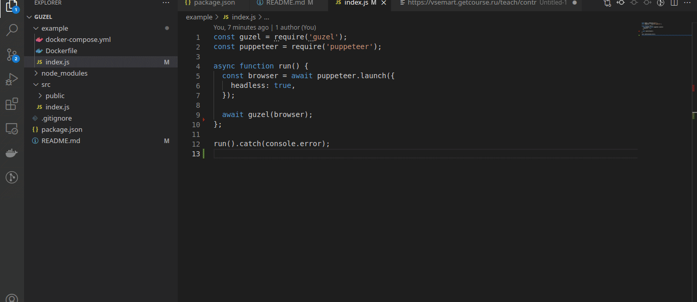

# guzel - remote headless puppeteer watcher

**güzel** /ɟy.zɛl/, Turkish, *adj* - beautiful

If you want to **connect to headless puppeteer**, you don't need to change your code at all. Just add the following lines for **guzel** activation!

```javascript
const guzel = require('guzel');

// const browser = await puppeteer.launch...

guzel(browser);
```

Then open `http://localhost:3208` to control your puppeteer browser.

## Demo



## Instalation

```
npm i -S gusel
```

## Usage

```javascript
const guzel = require('guzel');

//...

const browser = await puppeteer.launch({ headless: true, args: ['--no-sandbox'] });

await guzel(browser);

//...
```

## Remote browser (headless puppeteer remote usage)

You can run **guzel** on remote server (ex. `your-server.com`)

```ssh
ssh your-server.com
git clone git@github.com:ivanoff/guzel.git
cd guzel/example
sudo docker-compose up
```

Then open `your-server.com:3208` and start to surf the internet with your **guzel puppeteer**
